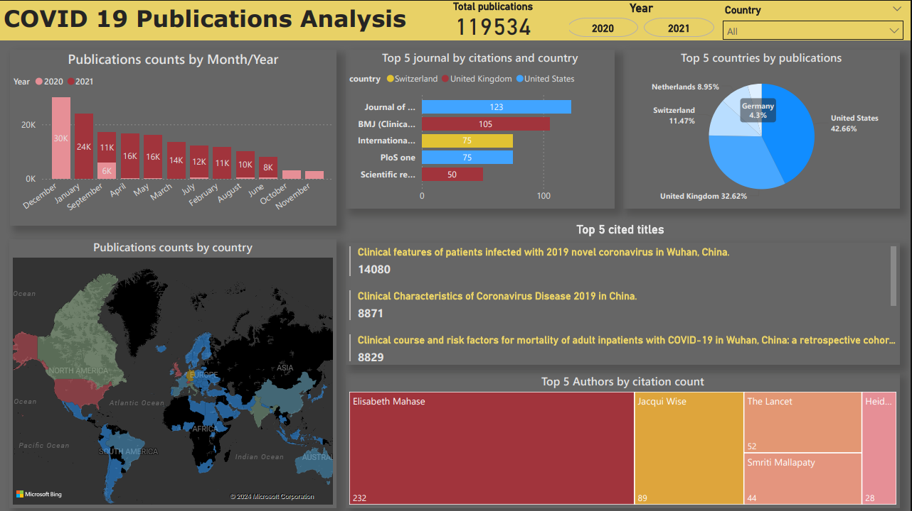

# COVID-19 Publications Dashboard 📊

This is my first independent Power BI project analyzing over **119,000 COVID-19 research publications** between 2020–2021.  
It visualizes global research trends, top-cited articles, journal impact, and contributions by country.

---

## 🔍 Project Overview

This dashboard explores:
- 📈 Monthly/Yearly surge in publication volume
- 🌍 Country-wise publication distribution (U.S., U.K., Switzerland, etc.)
- 📚 Top Journals by citation count (BMJ, The Lancet, etc.)
- 🧠 Most cited research papers and authors
- 🗺️ Geographical distribution via map visuals

---

## 🛠️ Tools & Technologies Used

- **Power BI Desktop**
- **Power Query** (ETL: transform & clean raw CSV data)
- **DAX** (for custom metrics and visual elements)

---

## 📌 Key Insights

- The U.S. led publication volume (42.6%), followed by the U.K. (32.6%)
- Top-cited paper: “Clinical features of patients infected with 2019 novel coronavirus in Wuhan, China” with 14,000+ citations
- BMJ Clinical Research & The Lancet led journal impact

---

## 📸 Dashboard Preview

> _Note: This uses a public dataset and shows non-sensitive insights._

  
*Visuals include line charts, bar charts, world map, and KPIs.*

---

## ⚠️ Current Status

> 🛠️ **Improvement Planned:**  
> This was my learning project while starting Power BI. I'm planning a version 2.0 with:
> - Enhanced layout & design consistency  
> - Better filtering & interactivity  
> - Refined data modeling

---

## 📈 Dataset Source

Data from: [CORD-19 Dataset on Kaggle](https://www.kaggle.com/datasets/allen-institute-for-ai/CORD-19-research-challenge)  
Contains metadata of COVID-19-related research articles.

---

## 🙋‍♂️ About Me

I'm a Data Research Analyst focused on Power BI, SQL, and Python.  
This project marks the start of my Power BI journey, and I'm constantly growing through hands-on work.

> 🔗 [LinkedIn Profile](https://www.linkedin.com/in/bharat-kumar-bh)

---
